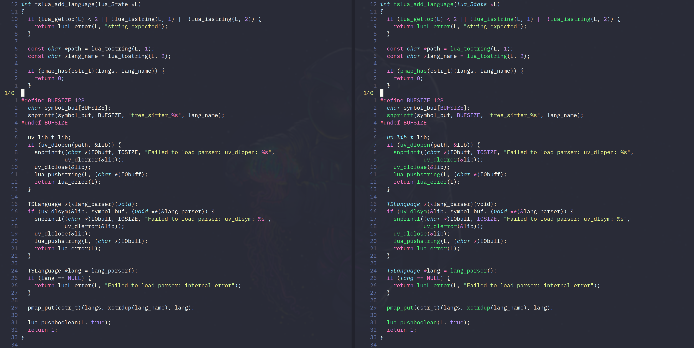

<div align="center">
  <h1>nvim-treesitter</h1>
  <p>
    <a href="https://nvim-treesitter.zulipchat.com/">
      
    </a>
    <a href="https://github.com/nvim-treesitter/nvim-treesitter/actions?query=workflow%3A%22Linting+and+style+checking%22+branch%3Amaster">
      
    </a>
    <a href="https://github.com/nvim-treesitter/nvim-treesitter/actions?query=workflow%3A%22Check+loading+of+syntax+files%22+branch%3Amaster">
      
    </a>
  </p>
</div>

<div align="center">
  <p>
    
  </p>
  <p>
    <a href="https://github.com/tree-sitter/tree-sitter">Treesitter</a>
    configurations and abstraction layer for
    <a href="https://github.com/neovim/neovim/">Neovim</a>.
  </p>
  <p>
    <i>
      Logo by <a href="https://github.com/steelsojka">@steelsojka</a>
    </i>
  </p>
</div>



Traditional highlighting (left) vs Treesitter-based highlighting (right).
See more examples in [our gallery](https://github.com/nvim-treesitter/nvim-treesitter/wiki/Gallery).

**Warning: Treesitter and Treesitter highlighting are an experimental feature of nightly versions of Neovim.
Please consider the experience with this plug-in as experimental until Neovim 0.5 is released!**

# Quickstart

## Requirements

- Neovim [nightly](https://github.com/neovim/neovim#install-from-source)
- `tar` and `curl` in your path (or alternativly `git`)
- A C compiler in your path and libstdc++ installed ([Windows users please read this!](https://github.com/nvim-treesitter/nvim-treesitter/wiki/Windows-support)).

## Installation

You can install `nvim-treesitter` with your favorite package manager, or using the default `pack` feature of Neovim!

### Using a package manager

If you are using [vim-plug](https://github.com/junegunn/vim-plug), put this in your `init.vim` file:

```vim
Plug 'nvim-treesitter/nvim-treesitter'
```

### Using Neovim `pack` feature

We highly recommend reading `:h packages` to learn more about this feature, but you can still follow these steps:

```sh
$ mkdir -p ~/.local/share/nvim/site/pack/nvim-treesitter/start
$ cd ~/.local/share/nvim/site/pack/nvim-treesitter/start
$ git clone https://github.com/nvim-treesitter/nvim-treesitter.git
```

## Adding parsers

Treesitter uses a different _parser_ for every language. It can be quite a pain to install, but fortunately `nvim-treesitter`
provides two command to tackle this issue:

- `TSInstall {language}` to install one or more parsers.
  `TSInstall <tab>` will give you a list of supported languages, or select `all` to install them all.
- `TSInstallInfo` to know which parser is installed.
- `TSUpdate` to update already installed parsers

Let's say you need parsers for `lua`, this is how you install it:

```vim
:TSInstall lua
Downloading...
Compiling...
Treesitter parser for lua has been installed
```

Cool, lets see which parsers are installed:

```vim
:TSInstallInfo
lua        [✓] installed
c          [✗] installed
html       [✗] not installed
typescript [✗] not installed
...
```

And now you should be ready to use every functionality `nvim-treesitter` provides!

## Setup

All modules are disabled by default,
so you'll need to activate them by putting this in your `init.vim` file:

```lua
require'nvim-treesitter.configs'.setup {
  ensure_installed = "maintained", -- one of "all", "maintained" (parsers with maintainers), or a list of languages
  highlight = {
    enable = true,              -- false will disable the whole extension
    disable = { "c", "rust" },  -- list of language that will be disabled
  },
}
```

Check [`:h nvim-treesitter-modules`](doc/nvim-treesitter.txt)
for a list of available modules and its options.

# Available modules

## Highlight

Consistent syntax highlighting.

```lua
require'nvim-treesitter.configs'.setup {
  highlight = {
    enable = true,
    use_languagetree = false, -- Use this to enable language injection (this is very unstable)
    custom_captures = {
      -- Highlight the @foo.bar capture group with the "Identifier" highlight group.
      ["foo.bar"] = "Identifier",
    },
  },
}
```

## Incremental selection

Incremental selection based on the named nodes from the grammar.

```lua
require'nvim-treesitter.configs'.setup {
  incremental_selection = {
    enable = true,
    keymaps = {
      init_selection = "gnn",
      node_incremental = "grn",
      scope_incremental = "grc",
      node_decremental = "grm",
    },
  },
}
```

## Indentation

Treesitter based indentation (`=` vim behavior)

```lua
require'nvim-treesitter.config'.setup {
  indent = {
    enable = true
  }
}
```

# External modules

Other modules can be installed as plugins.

- [refactor](https://github.com/nvim-treesitter/nvim-treesitter-refactor) - Refactoring and definition modules
- [textobjects](https://github.com/nvim-treesitter/nvim-treesitter-textobjects) - Textobjects defined by tree-sitter queries
- [playground](https://github.com/nvim-treesitter/playground) - Treesitter integrated playground
- [context](https://github.com/romgrk/nvim-treesitter-context) - Show parent code context in a popover


# Extra features

## Syntax based code folding

```vim
set foldmethod=expr
set foldexpr=nvim_treesitter#foldexpr()
```

This will respect your `foldnestmax` setting.

## Statusline indicator

```vim
echo nvim_treesitter#statusline(90)  " 90 can be any length
module->expression_statement->call->identifier
```

# Commands

Each feature can be enabled or disabled by different means:

```vim
:TSBufEnable {module} " enable module on current buffer
:TSBufDisable {module} " disable module on current buffer
:TSEnableAll {module} [{ft}] " enable module on every buffer. If filetype is specified, enable only for this filetype.
:TSDisableAll {module} [{ft}] " disable module on every buffer. If filetype is specified, disable only for this filetype.
:TSModuleInfo [{module}] " list information about modules state for each filetype
```

Check [`:h nvim-treesitter-commands`](doc/nvim-treesitter.txt) for a list of all available commands.

# Supported Languages

For `nvim-treesitter` to work, we need to use query files such as those you can find in
`queries/{lang}/{locals,highlights,textobjects}.scm`

We are looking for maintainers to write query files for their languages.

List of currently supported languages:

<!--This section of the README is automatically updated by a CI job-->
<!--parserinfo-->
- [x] [bash](https://github.com/tree-sitter/tree-sitter-bash) (maintained by @TravonteD)
- [x] [c](https://github.com/tree-sitter/tree-sitter-c) (maintained by @vigoux)
- [x] [c_sharp](https://github.com/tree-sitter/tree-sitter-c-sharp) (maintained by @svermeulen)
- [x] [cpp](https://github.com/tree-sitter/tree-sitter-cpp) (maintained by @theHamsta)
- [x] [css](https://github.com/tree-sitter/tree-sitter-css) (maintained by @TravonteD)
- [x] [dart](https://github.com/UserNobody14/tree-sitter-dart) (maintained by @Akin909)
- [ ] [elm](https://github.com/razzeee/tree-sitter-elm)
- [x] [fennel](https://github.com/travonted/tree-sitter-fennel) (maintained by @TravonteD)
- [x] [go](https://github.com/tree-sitter/tree-sitter-go) (maintained by @theHamsta, @WinWisely268)
- [ ] [haskell](https://github.com/tree-sitter/tree-sitter-haskell)
- [x] [html](https://github.com/tree-sitter/tree-sitter-html) (maintained by @TravonteD)
- [x] [java](https://github.com/tree-sitter/tree-sitter-java) (maintained by @p00f)
- [x] [javascript](https://github.com/tree-sitter/tree-sitter-javascript) (maintained by @steelsojka)
- [x] [jsdoc](https://github.com/tree-sitter/tree-sitter-jsdoc) (maintained by @steelsojka)
- [x] [json](https://github.com/tree-sitter/tree-sitter-json) (maintained by @steelsojka)
- [ ] [julia](https://github.com/tree-sitter/tree-sitter-julia)
- [x] [lua](https://github.com/nvim-treesitter/tree-sitter-lua) (maintained by @vigoux)
- [ ] [nix](https://github.com/cstrahan/tree-sitter-nix)
- [x] [ocaml](https://github.com/tree-sitter/tree-sitter-ocaml) (maintained by @undu)
- [x] [ocaml_interface](https://github.com/tree-sitter/tree-sitter-ocaml) (maintained by @undu)
- [x] [ocamllex](https://github.com/atom-ocaml/tree-sitter-ocamllex) (maintained by @undu)
- [x] [php](https://github.com/tree-sitter/tree-sitter-php) (maintained by @tk-shirasaka)
- [x] [python](https://github.com/tree-sitter/tree-sitter-python) (maintained by @stsewd, @theHamsta)
- [x] [ql](https://github.com/tree-sitter/tree-sitter-ql) (maintained by @pwntester)
- [x] [Tree-sitter query language](https://github.com/nvim-treesitter/tree-sitter-query) (maintained by @steelsojka)
- [x] [regex](https://github.com/tree-sitter/tree-sitter-regex) (maintained by @theHamsta)
- [x] [rst](https://github.com/stsewd/tree-sitter-rst) (maintained by @stsewd)
- [x] [ruby](https://github.com/tree-sitter/tree-sitter-ruby) (maintained by @TravonteD)
- [x] [rust](https://github.com/tree-sitter/tree-sitter-rust) (maintained by @vigoux)
- [ ] [scala](https://github.com/tree-sitter/tree-sitter-scala)
- [ ] [swift](https://github.com/tree-sitter/tree-sitter-swift)
- [x] [teal](https://github.com/euclidianAce/tree-sitter-teal) (maintained by @euclidianAce)
- [x] [toml](https://github.com/ikatyang/tree-sitter-toml) (maintained by @tk-shirasaka)
- [ ] [tsx](https://github.com/tree-sitter/tree-sitter-typescript)
- [x] [typescript](https://github.com/tree-sitter/tree-sitter-typescript) (maintained by @steelsojka)
- [x] [verilog](https://github.com/tree-sitter/tree-sitter-verilog) (maintained by @zegervdv)
- [ ] [vue](https://github.com/ikatyang/tree-sitter-vue)
- [ ] [yaml](https://github.com/ikatyang/tree-sitter-yaml)
<!--parserinfo-->

# Roadmap

The goal of `nvim-treesitter` is both to provide a simple and easy way to use the interface for Treesitter in Neovim,
but also to add some functionalities to it.

You can find the roadmap [here](https://github.com/nvim-treesitter/nvim-treesitter/projects/1).
The roadmap and all features of this plugin are open to change, and any suggestion will be highly appreciated!

# Defining Modules

Users and plugin authors can take advantage of modules by creating their own. Modules provide:

- Treesitter language detection support
- Attach and detach to buffers
- Works with all nvim-treesitter commands

You can use the `define_modules` function to define one or more modules or module groups.

```lua
require'nvim-treesitter'.define_modules {
  my_cool_plugin = {
    attach = function(bufnr, lang)
      -- Do cool stuff here
    end,
    detach = function(bufnr)
      -- Undo cool stuff here
    end,
    is_supported = function(lang)
      -- Check if the language is supported
    end
  }
}
```

Modules can consist of the following properties:

- `module_path`: A require path (string) that exports a module with an `attach` and `detach` function. This is not required if the functions are on this definition.
- `enable`: Determines if the module is enabled by default. This is usually overridden by the user.
- `disable`: A list of languages that this module is disabled for. This is usually overridden by the user.
- `is_supported`: A function that takes a language and determines if this module supports that language.
- `attach`: A function that attaches to a buffer. This is required if `module_path` is not provided.
- `detach`: A function that detaches from a buffer. This is required if `module_path` is not provided.

# Utils

You can get some utility functions with

```lua
local ts_utils = require 'nvim-treesitter.ts_utils'
```

Check [`:h nvim-treesitter-utils`](doc/nvim-treesitter.txt) for more information.

# User Query Extensions

Queries are what `nvim-treesitter` uses to extract informations from the syntax tree, and they are
located in the `queries/{lang}/*` runtime directories (like the `queries` folder of this plugin).

`nvim-treesitter` considers queries as any runtime file (see `:h rtp`), that is :

- if the file is in any `after/queries/` folder, then it will be used to extend the already defined
  queries.
- Otherwise, it will be used as a base to define the query, the first query found (with the highest
  priority) will be the only one to be used.

This hybrid approach is the most standard way, and according to that, here is some ideas on how to
use is :
- If you want to rewrite (or write) a query, don't use `after/queries`.
- If you want to override a part of a query (only one match for example), use the `after/queries`
  directory.

# Troubleshooting

Before doing anything make sure you have the latest version of this plugin and run `:checkhealth nvim_treesitter`.
This will help you find where the bug might come from.

## Feature `X` does not work for `{language}`...

First, check the `## {language} parser healthcheck` section of `:checkhealth` if you have any warning.
If you do, it's highly possible that this is the cause of the problem.
If everything is okay, then it might be an actual error.

In both cases, feel free to [open an issue here](https://github.com/nvim-treesitter/nvim-treesitter/issues/new/choose).

## I get `module 'vim.treesitter.query' not found`

Make sure you have the latest nightly version of Neovim.

## I get `Error detected while processing .../plugin/nvim-treesitter.vim` every time I open Neovim

This is probably due to a change in a parser's grammar or its queries.
Try updating the parser that you suspect has changed (`:TSUpdate {language}`) or all of them (`:TSUpdate`).
If the error persists after updating all parsers,
please [open an issue](https://github.com/nvim-treesitter/nvim-treesitter/issues/new/choose).

## I experience weird highlighting issues similar to [#78](https://github.com/nvim-treesitter/nvim-treesitter/issues/78)

This is a well known issue, which arise when the tree and the buffer are getting out of sync.
As this issue comes from upstream, we don't have any finite fix. To get around this, you can force reparsing the buffer with this command:

```vim
:write | edit | TSBufEnable highlight
```

This will save, restore and enable highlighting for the current buffer, fixing the issue.

## I experience bugs when using `nvim-treesitter`'s `foldexpr` similar to [#194](https://github.com/nvim-treesitter/nvim-treesitter/issues/194)

This might happen, and is known to happen with `vim-clap`, to avoid those kind of errors, please use
`setlocal` instead of `set` for the appropriate filetypes.
